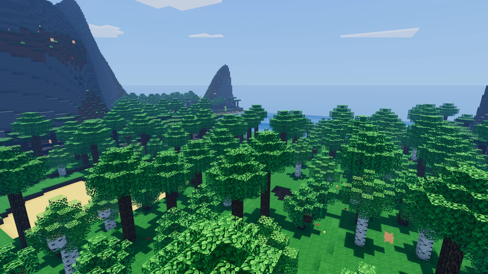
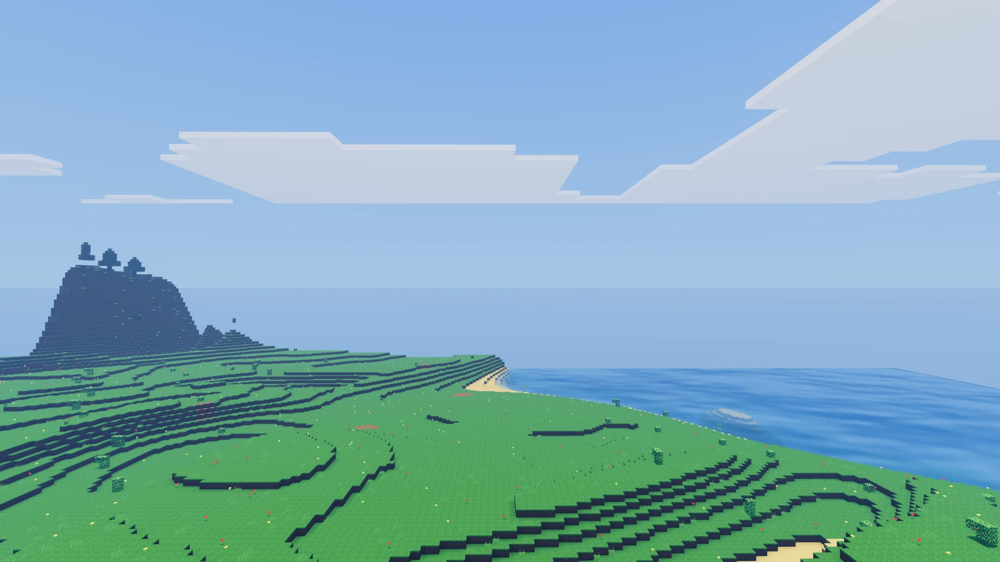
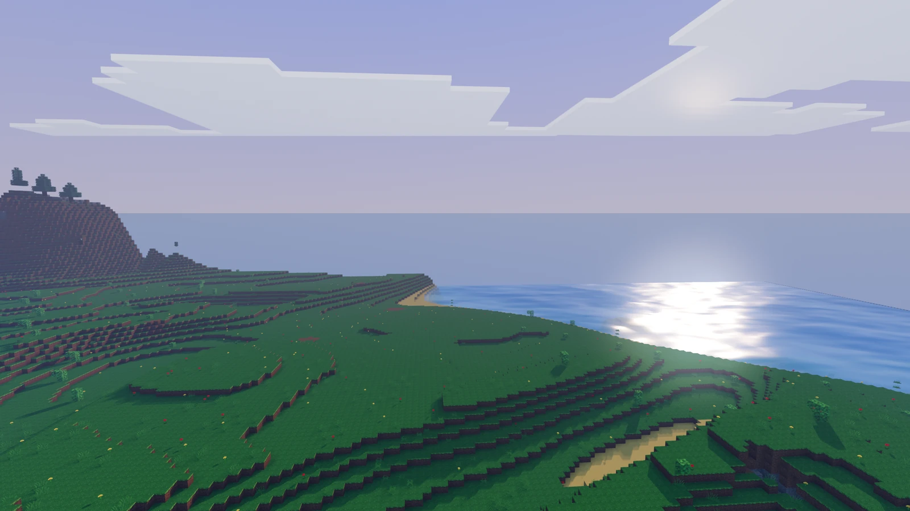
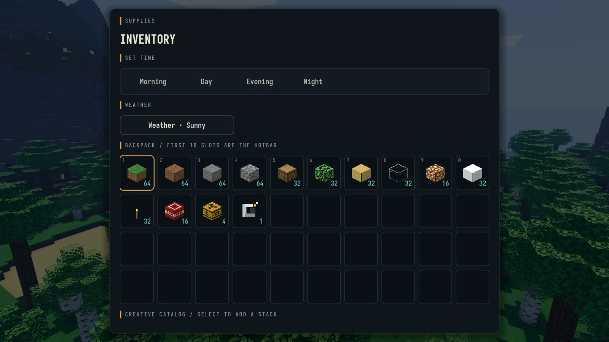

<div align="center">

# RedotCraft

**Explore a world shaped by climate. Build it block by block.**

A Minecraft-inspired, single-player voxel sandbox built with **Redot Engine 26.2**, GDScript, and the Forward+ renderer.

[Get started](#get-started) · [Features](#a-world-worth-exploring) · [Controls](#controls) · [Development](#development) · [Roadmap](ROADMAP.md)



*Procedural terrain, real-time lighting, and a world you can reshape.*

</div>

RedotCraft brings together seeded world generation, editable terrain, Survival progression, and a free-building Creative mode. Wander from wildflower-covered coasts to deep forests, craft your first tools, dig into caves, or take a detached camera above the canopy to find your next build site.

**Status:** playable and actively evolving. Survival and Creative, crafting, world saves, weather, and photo mode are implemented. Mobs, combat, renewable farming, and the command console are still on the [roadmap](ROADMAP.md).

## A world worth exploring

### Landscapes with a sense of place

- **Seeded, climate-driven terrain:** continents, islands, coasts, rivers, rolling plains, mountains, and broad biome regions built through a TerraForged-inspired generation pipeline.
- **Distinct vegetation:** oak, birch, spruce, acacia, jungle, and mangrove trees, with grasses, wildflowers, reeds, mushrooms, bamboo, and biome-specific ground cover.
- **Above and below the surface:** cave regions, ore veins, aquifers, lava basins, and scattered structures; underwater kelp forests, seagrass meadows, coral reefs, and frozen oceans.
- **Your kind of world:** Normal, Flat, and Amplified generation, with seed input and advanced controls for landmass, biome scale, rivers, erosion, caves, and vegetation.

| Coastal terrain | Evening reflections |
| :---: | :---: |
|  |  |
| Wildflowers, stepped hills, and open water. | A changing sky and light that follows the time of day. |

### Two ways to play

| Survival | Creative |
| --- | --- |
| Start with an empty inventory and gather physical item drops. | Build with a free item catalog and unlimited placement. |
| Craft wooden, stone, and iron tools; manage durability. | Mine instantly and fly with a boosted movement option. |
| Watch health, hunger, and air; eat, recover, and respawn. | Explore without survival damage, hunger, or tool wear. |
| Use crafting tables, chests, furnaces, and beds. | Experiment with materials, lighting, terrain, and explosives. |

Choose the mode when creating a world. For the Survival path from your first log to iron tools, see the [crafting guide](CRAFTING.md).

### Build, reshape, and keep your world

- Place and break blocks with targeting, mining cracks, debris, and held-item feedback.
- Build with stairs, slabs, doors, ladders, signs, and beds alongside the standard block palette.
- Work with flowing water, falling sand and gravel, spreading fire, and terrain-carving TNT and nukes.
- Keep your inventory, player state, stations, block edits, time, and weather across sessions.
- Manage saved worlds with loading, renaming, duplication, manual backups, and configurable autosaves.

### Atmosphere and presentation

Dynamic day/night lighting, stars and moon phases, animated water with refraction and shore foam, colored voxel light, ambient occlusion, and wind-swaying foliage give the terrain depth. Weather adds rain, lightning and thunder, cold-biome snow, and swamp mist; underwater views get their own grading, fog, and muffled audio.

The **Deepslate & Ember** interface pairs dark panels and warm accents with texture-derived block icons, a ten-slot hotbar, a recipe book, world maps, rebindable controls, and adjustable UI/text scaling.



*Creative inventory shown; time/weather controls and the free catalog are Creative-only.*

## Get started

### Requirements

- [Redot Engine](https://redotengine.org/) **26.2 stable**.
- A graphics device and driver capable of running **Forward+**. The project uses Vulkan rendering and advanced lighting effects.
- A local checkout of this repository. Gameplay is GDScript-only; there is no separate package install or native build step.

### Run from the editor

1. Import `project.godot` into Redot 26.2.
2. Let the editor finish importing textures, fonts, and audio.
3. Press **F6** to run the current scene or **F5** to launch the project from its main menu.
4. Open **Play**, create a world, choose Survival or Creative, and enter a seed or use the generated one.

### Run from a terminal

With `redot` on your `PATH`, run these commands from the repository root:

```sh
# Import assets on the first run.
redot --editor --headless --path . --quit

# Launch the game.
redot --path .
```

On Linux, the included launcher also supports `./run.sh` and `./run.sh --editor`.

**Graphics tip:** start with the Medium preset and the default render distance. Display settings offer **Full Detail** (the default) or **Balanced LOD**, which uses compact distance terrain beyond the nearby full-detail ring. Higher render distances increase generation time and memory use; adjust distance and render scale to suit your hardware.

## Controls

Default bindings are shown below. Keyboard actions can be changed in **Settings → Controls**.

| Action | Binding |
| --- | --- |
| Move / look | **W A S D** / mouse |
| Jump / sprint / crouch | **Space** / **Shift** / **C** |
| Mine | Hold **left mouse button** in Survival; instant in Creative |
| Place / use / interact | **Right mouse button** |
| Pick targeted block | **Middle mouse button** or **B** |
| Select hotbar slot | **1–9**, **0**, or mouse wheel |
| Inventory and crafting | **E** |
| Toggle third-person camera | **F5** |
| Toggle flight (Creative) | Double-tap **Space** |
| Fly up / down / boost | **Space** / **Shift** / **Ctrl** |
| World map / minimap / map mode | **M** / **]** / **N** |
| Pause / close current panel | **Esc** |
| Hide HUD / save clean screenshot | **F1** / **F2** |
| Detached photo camera | **P** |

### Take your own screenshots

Press **P** to enter the detached photo camera. Fly with **WASD**, rise/descend with **Space/Shift**, hold **Ctrl** to boost, and use the mouse wheel to zoom. **P** or **Esc** returns to the player.

**F2** saves a PNG to `user://screenshots/`, hiding the HUD and UI layers for the capture. `user://` is Redot's per-user application-data directory, outside the repository. **F1** toggles the HUD while you compose a shot.

The images on this page are real Forward+ captures from the current game, using seed **918273**. [Capture details](docs/screenshots/README.md).

## Under the hood

RedotCraft implements its voxel systems in GDScript, using Redot's worker pool for terrain generation and meshing.

| System | Approach |
| --- | --- |
| World layout | 16 × 16 chunks, 192-block vertical range, sea level at 48 |
| Generation | Immutable staged terrain fields, climate biomes, surfaces, caves, ores, and deterministic cross-chunk decoration |
| Streaming | Nearest-first scheduling, threaded generation/meshing, nearby collision prioritization, and optional compact LOD |
| Rendering | Texture arrays, per-vertex ambient occlusion, flood-filled sky/RGB block light, and custom block/water shaders |
| Persistence | Versioned metadata and compressed region files storing sparse block edits and gameplay state |
| Interface | A shared theme and component factory, reusable motion, and signal-driven screen flows |

### Project layout

```text
autoload/        Settings, world configuration, and audio management
game/            Gameplay orchestration, inventory, crafting, drops, photo mode
player/          Movement, targeting, survival, and interaction effects
world/           Streaming, meshing, lighting, simulation, and atmosphere
world/worldgen/  Terrain pipeline and biome/decoration/ore catalogs
ui/              Menus, HUD, inventory, maps, and shared theme
assets/          Textures, shaders, fonts, and recorded audio
tools/           Headless verifiers and rendered profiling scenes
docs/screenshots/ README gallery and capture notes
```

## Development

Open the project with `redot --editor --path .`. The repository uses focused engine-run verification scripts; no external test framework is required.

```sh
# Check script/scene loading and import assets.
redot --editor --headless --path . --quit

# Run the core verification suite.
redot --headless --path . --script res://tools/unit_tests.gd

# Verify world generation and save storage.
redot --headless --path . --script res://tools/worldgen_verify.gd
redot --headless --path . --script res://tools/world_storage_verify.gd

# Example scene-based gameplay verifier (loads autoloads).
redot --headless --path . res://tools/player_target_verify.tscn
```

Rendering checks and GPU profiles need a real display. The full verifier list and contributor conventions are in [AGENTS.md](AGENTS.md), and CI runs sharded checks under [`.github/workflows/`](.github/workflows/).

### Further reading

- [Roadmap](ROADMAP.md) — implemented systems, planned features, and measured findings.
- [Crafting and Survival progression](CRAFTING.md) — recipes, resources, stations, and tool tiers.
- [World-generation architecture](world/worldgen/README.md) — pipeline stages and tuning guardrails.
- [UI architecture](ui/README.md) — theme, screen flows, and interaction rules.
- [Chunk performance notes](tools/CHUNK_PERFORMANCE.md) — benchmarks, profiling, and streaming tradeoffs.

## Credits and assets

- **Redot Engine** provides the engine and Forward+ renderer.
- **TerraForged** inspired the staged terrain-generation approach.
- **ZigCraft / OpenStaticFish** supplied development placeholder textures and the inspiration for the water-shader port. Some textures originate from third-party resource packs; their provenance and redistribution notes are in [the asset README](assets/placeholders/zigcraft/README.md).
- **VoxeLibre**, **Kenney**, and **OpenGameArt** supplied recorded sound effects and weather ambience. Attribution and per-pack license files live in [`assets/audio/`](assets/audio/).
- Bundled **Iosevka** fonts provide the interface typography; font license files live in [`assets/fonts/`](assets/fonts/).

RedotCraft is an independent Minecraft-inspired project and is not affiliated with Mojang or Microsoft.
